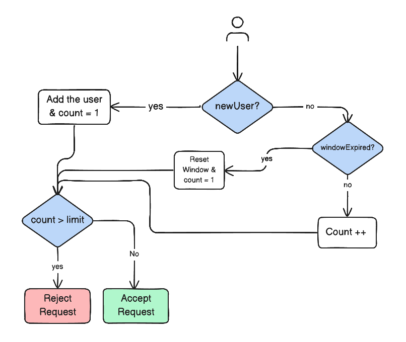

# Fixed Window Rate Limiter

A simple implementation of the **Fixed Window Rate Limiting** algorithm using Node.js and Express.

This project demonstrates how to control the number of requests a client (IP address) can make within a fixed time window.

---

## What is Rate Limiting?

Rate limiting is a technique used to restrict how many requests a client can send to a server within a specific time period.

It helps to:

- Prevent server overload
- Protect against brute force attacks
- Ensure fair usage of resources
- Improve API reliability

Example:

Allow only 5 requests per IP every 1 minute.  
If a client sends more than 5 requests within that minute, the server returns:

HTTP 429 Too Many Requests

---

## Algorithm: Fixed Window

The Fixed Window algorithm divides time into fixed intervals (for example, 60 seconds).

For each IP address:

1. Track the number of requests within the current window.
2. If the count is within the limit, allow the request.
3. If the count exceeds the limit, return HTTP 429.
4. When the window expires, reset the counter.

Note:
This approach may allow burst traffic at the boundary of time windows.

---

## System Flow

Request flow:

Client  
→ Express Server  
→ Rate Limiter Middleware  
→ Route Handler  
→ Response  

The middleware:

- Identifies client IP
- Checks whether the IP is new
- Verifies if the time window expired
- Increments request count
- Accepts or rejects the request

---

## System Diagram

The system diagram illustrates the following logic:

1. Check if the user is new.
   - If yes → Initialize count = 1.
2. If existing user → Check if window expired.
   - If expired → Reset window and set count = 1.
   - If not expired → Increment count.
3. Check if count exceeds the limit.
   - If yes → Reject request (429).
   - If no → Accept request.

---

## Configuration

Example configuration:

- Time window: 60 seconds
- Max requests: 5

Example variables:

- windowDuration = 60000 (milliseconds)
- maxRequests = 5

Data is stored in memory:

IP → { count, startTime }

Important:

- Data resets when the server restarts
- Not suitable for distributed systems
- For production use, consider Redis or shared storage

---

## Implementation Logic

For each incoming request:

1. Extract client IP address.
2. If IP does not exist in memory:
   - Set count = 1
   - Set startTime = current time
3. If IP exists:
   - If window expired:
     - Reset count = 1
     - Update startTime
   - Else:
     - Increment count
4. If count > maxRequests:
   - Return HTTP 429
5. Otherwise:
   - Call next()

---

## Advantages

- Simple and easy to understand
- Low overhead
- Good for learning backend fundamentals

---

## Limitations

- Burst traffic at window boundaries
- In memory storage is not persistent
- Not suitable for multi server environments

---

## Use Cases

- Login attempt limiting
- API request throttling
- OTP protection
- Password reset protection
- Public API endpoints

---

## Conclusion

This project provides a clear and practical implementation of the Fixed Window Rate Limiter in Node.js.

It demonstrates how backend systems:

- Track request frequency
- Enforce request limits
- Protect resources from abuse

Ideal for learning and small scale applications.
